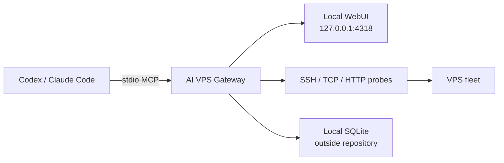

# AI VPS Gateway

<p align="center">
  <picture>
    <source media="(prefers-color-scheme: dark)" srcset="./assets/brand-wordmark.png">
    
  </picture>
</p>

<p align="center">
  <strong>Local-first control plane for AI-assisted VPS operations.</strong><br>
  Manage servers, projects, health checks, runbooks, and MCP access from one local gateway.
</p>

<p align="center">
  <a href="./README.zh-CN.md">中文文档</a> ·
  <a href="https://kukuaki.github.io/ai-vps-gateway/">Project website</a> ·
  <a href="#quick-start">Quick start</a> ·
  <a href="#mcp">MCP</a> ·
  <a href="https://github.com/kukuaki/ai-vps-gateway/releases/latest">macOS release</a>
</p>

<p align="center">
  <a href="https://github.com/kukuaki/ai-vps-gateway/releases"></a>
  <a href="https://github.com/kukuaki/ai-vps-gateway/blob/main/LICENSE"></a>
  
  
</p>

> [!IMPORTANT]
> AI clients never receive private keys or an unrestricted SSH path. They request work from this loopback-only gateway, which owns the SSH process, serializes access per VPS, records high-risk actions, and keeps runtime data outside the repository.

> [!NOTE]
> The gateway is a local control boundary, not an operating-system sandbox. Processes running as the same macOS user may still access the gateway data directory. Use a protected user account and do not grant untrusted local software filesystem access.

## At a glance

| Capability | What it provides |
| --- | --- |
| **VPS control** | Manual assets, first-run SSH binding, TCP/SSH/HTTP(S) liveness, maintenance and archive states. |
| **Project operations** | Service inventory, technology stacks, ports, Web endpoints, deployment notes and persistent Runbooks. |
| **AI access** | Local stdio MCP tools for Codex and Claude Code, with one active session per VPS and queueing for later requests. |
| **Observability** | Current snapshots, 30-day metric history, trend charts, threshold alerts and audit events. |

## Screenshots

<p align="center">
  <a href="https://kukuaki.github.io/ai-vps-gateway/">
    
  </a>
</p>

<p align="center"><sub>All screenshots use repository demo data and documentation-only IP ranges. See the <a href="https://kukuaki.github.io/ai-vps-gateway/">project website</a> for the complete product tour.</sub></p>

## Quick start

### macOS desktop

Download the [latest Apple Silicon release](https://github.com/kukuaki/ai-vps-gateway/releases/latest), open the DMG, and launch **AI VPS Gateway**. The app starts the local API, WebUI and MCP support together, then remains available from the macOS menubar when the window is hidden.

### From source

```bash
npm install
npm run dev
```

Open `http://127.0.0.1:5173`. Run `npm run typecheck`, `npm test`, and `npm run build` before packaging or distributing a build.

## Architecture



## What it does

- Manual VPS inventory with local SQLite persistence and guided first-run SSH binding for newly added VPS assets.
- Synchronize VPS inventory and documented domain health checks from an existing `all-vps` directory.
- Network-safe liveness checks: TCP, SSH banner, and HTTP(S). ICMP is intentionally not required.
- Health history, current metric snapshots, 30-day metric history, SVG trend charts, threshold alerts, audit events, archive and maintenance states.
- Project records linking VPS assets, Docker/systemd/process services, and structured runbooks.
- Read-only remote project inventory that discovers Docker, systemd, listening ports, and common manifests, then updates generated project runbooks.
- A local Vue WebUI bound to `127.0.0.1`.
- A local stdio MCP gateway for Codex and Claude Code. Read operations are available immediately; remote commands require an exclusive gateway session.

The gateway deliberately does **not** read, upload, or expose private key contents. For a new VPS it can create a dedicated Ed25519 keypair in the gateway-owned credential directory; Node returns only the public key and lets the local `ssh` process use the private file. Existing-key imports remain opaque local file copies without parsing key bytes.

## Security model

- This repository must never contain private keys, `.env` files, access tokens, or production database dumps.
- The WebUI and API are loopback-only by default.
- MCP command execution is loopback-only and lease-based: one VPS has one active session, later sessions queue, idle sessions expire after 30 minutes, and every session has an eight-hour maximum by default.
- High-risk commands are recorded with a warning severity. A small absolute denylist blocks common root-directory recursive deletion, filesystem formatting, block-device writes, and fork-bomb patterns. This is a guardrail, not a complete shell sandbox.
- Registered root SSH assets can open a normal session directly after credential and host-key checks. The WebUI's optional eight-hour root-rescue marker adds a prominent high-risk audit signal; it is not required for sessions, metrics, inventory, or commands, and toggling it never interrupts an existing session.
- Command text and output are redacted before persistence and command records are pruned after 90 days by default. Asset/project summaries and audit events remain in local SQLite.
- A failed ICMP ping does not mark a VPS offline. SSH/TCP and configured service probes are authoritative.
- SSH execution never inherits HTTP/SOCKS proxy variables, disables `ProxyCommand` and `ProxyJump`, and can bind selected assets to a physical interface with `networkMode=direct`. This is useful when a macOS TUN client would otherwise make a domestic provider see a proxy egress address. Public HTTP(S) health checks use the system route by default so they validate the actual public-domain path rather than being mistaken for origin SSH traffic.
- A first-run binding test may use `StrictHostKeyChecking=accept-new` only to record a previously unknown host fingerprint locally. Every later operation requires a strict fingerprint match; a changed known key is never replaced automatically.
- The `all-vps` synchronizer never reads private keys. Its sync operation preserves the local credential reference and emergency-root state.

## Requirements

- macOS or Linux
- Node.js 24+
- npm 11+
- OpenSSH client tools: `ssh` and `ssh-keygen`

## Development

```bash
npm install
npm run dev
```

Open `http://127.0.0.1:5173`.

```bash
npm run typecheck
npm run test
npm run build
```

Runtime data is stored outside the repository by default:

```text
~/Library/Application Support/AI VPS Gateway/gateway.sqlite
```

Set `ALLVPS_DATA_DIR` to override it during development or testing.

When the gateway stays running, the metric scheduler collects eligible VPS snapshots every five minutes and retains them for 30 days, including manually added, synchronized, and registered root assets. The overview and VPS detail pages show the stored history; CPU at 90% or above, memory at 90% or above, disk at 85% or above, and a transition to unavailable performance create a deduplicated warning audit event. The bulk performance action covers every unarchived registered VPS, not only assets imported from `all-vps`.

## macOS Desktop Client

The desktop client combines the local API, MCP adapter support, WebUI, and a macOS menubar resident in one application. Double-clicking the app binds the gateway to `127.0.0.1:4318` and opens the visual interface. Closing or minimizing the window hides it while the local gateway and MCP remain available; click the menubar icon to open the menu, then choose the dashboard, MCP settings, data directory, or exit. On exit it stops only the local gateway process started by that app; it never stops a remote VPS service. Runtime data and credentials remain in the user data directory and are not bundled into the application.

Build an arm64 package on an Apple Silicon Mac:

```bash
npm run package:desktop
```

The desktop packaging command uses a temporary isolated staging copy and writes artifacts to `release/`; it does not let electron-builder rewrite the source package manifest.

Artifacts are written to `release/` as `.dmg` and `.zip` files. During development, `npm run run:desktop` opens the built desktop window. The app icon, WebUI brand mark, and menubar template are packaged separately so macOS can use the correct icon treatment in each location. The MCP setup button in the top-right corner can register Codex or Claude Code with one click; standard MCP connections are still spawned by the respective AI client over stdio, and the client reaches remote hosts only through the local gateway API.

SSH execution uses these local-only defaults:

```text
~/Library/Application Support/AI VPS Gateway/credentials/
~/.ssh/known_hosts
```

For a newly added VPS, the WebUI creates a dedicated Ed25519 pair automatically. It shows only the public key and an idempotent one-line installation command. Use a cloud-provider Web console, an existing SSH login, or another already-authorized path once to run that command as the selected SSH user, then click **Test binding** in the WebUI. A successful non-interactive SSH test stores the logical key reference and unlocks sessions, inventory, and metrics. The private key stays in the gateway directory with mode `0600`; it is never shown in the UI, copied into the repository, or handed to an AI client.

The first successful test accepts a new host key into local `known_hosts`; subsequent operations require an exact match and fail if the server was reinstalled or its host key changed. Existing manually imported keys continue to work through their logical `credentialRef`. Set `ALLVPS_CREDENTIAL_DIR` or `ALLVPS_KNOWN_HOSTS_FILE` to use another location.

## Synchronizing an Existing all-vps Inventory

The default local source is:

```text
~/Desktop/all-vps/VPS_INVENTORY.md
~/Desktop/all-vps/DOMAINS.md
```

Use the sync preview in the WebUI header, or run:

```bash
npm run sync:all-vps -- --dry-run
npm run sync:all-vps
```

Set `ALLVPS_SOURCE_DIR` to use another local directory. The synchronizer reads only those two Markdown documents. It does not scan the directory, read `.key` files, or import private keys, tokens, passwords, or environment variables.

Synchronization identifies an asset by SSH address and port, then updates documented identity, SSH login metadata, role, tags, network route, and HTTP health checks. VPS records intentionally keep `accessUrl` empty: public Web addresses belong to project records because one VPS may host many unrelated sites. Local credential references, maintenance state, and optional root-rescue state are preserved. Assets removed from the source documents are shown in the preview and are never automatically archived. The WebUI validates the preview digest before applying a sync, so a changed source must be previewed again.

## Synchronizing Remote Projects

The project inventory is a read-only SSH operation. It collects bounded metadata only: hostname, OS, Docker container names/images/status/port mappings/mounts, non-baseline systemd units, PM2 or Node process names/PIDs/working directories/listening ports, project manifest paths and dependency names, plus filtered active Nginx routing directives (`server_name`, `listen`, `proxy_pass`, and `root`). It does not read environment variables, logs, private keys, tokens, or complete configuration files. Nginx routes are associated with a project through the static root, upstream port, process working directory, and service manager evidence; a domain is therefore stored as a project Web endpoint instead of becoming a standalone project. Server-level health-check domains are used only for VPS liveness and are never attached to a project by assumption; `acme`, `letsencrypt`, and `certbot` challenge roots are also excluded as site entries. A public S-UI Docker mapping on `2095/tcp` is recorded as its default panel URL, `http://<server>:2095/app/`; the subscription port is not treated as a normal Web endpoint. The result is stored locally and used to create or update deterministic `remote-inventory` projects with technology-stack labels, project-level Web endpoints when discovered, detailed services, and overview, deployment, verification, troubleshooting, and guardrail sections. Missing automatic projects are archived rather than deleted; after a successful complete inventory pass, their historical records are detached from live VPS associations, while a warning-bearing partial inventory does not archive anything.

```bash
npm run sync:vps-projects
```

The WebUI and MCP also provide single-server and all-server inventory actions. The bulk project inventory covers every unarchived registered VPS, including manually added assets; the `all-vps` name remains for compatibility with the existing command and MCP tool.

## SSH Network Routing

Each VPS has a `system` or `direct` SSH network mode. all-vps assets and new WebUI assets default to `direct`; it makes the SSH/TCP baseline bind the detected physical interface (or `ALLVPS_SSH_DIRECT_INTERFACE`, such as `en0`) and avoids local TUN/proxy routing. Public HTTP(S) health checks default to `system`, which evaluates the public-domain path through the operating system route. A health check can explicitly select `direct` when it should connect to the registered VPS address while preserving its configured Host and TLS SNI. The modes affect gateway traffic only and do not change Clash/TUN global routing rules.

## Importing all-vps Credentials

This explicit local command is separate from Markdown synchronization. It only examines top-level `.key` and `.pem` filenames containing a registered VPS address, and requires exactly one match per VPS. It does not read, print, or upload key contents, delete the source file, overwrite an existing reference, or overwrite an existing gateway credential file.

```bash
npm run import:all-vps-credentials -- --dry-run
npm run import:all-vps-credentials
```

Imported copies are placed in `~/Library/Application Support/AI VPS Gateway/credentials/` with directory mode `0700` and file mode `0600`. The database stores only the logical filename.

## MCP

Start the local API first, then register the stdio adapter with your client:

```json
{
  "mcpServers": {
    "ai-vps-gateway": {
      "command": "npm",
      "args": ["--prefix", "/absolute/path/to/ai-vps-gateway", "run", "mcp"]
    }
  }
}
```

With the macOS desktop client, the AI client does not need to start Node/npm. Open `AI VPS Gateway.app` from the desktop, then use the MCP setup button in the top-right corner to register it. The equivalent stdio configuration is:

```json
{
  "mcpServers": {
    "ai-vps-gateway": {
      "command": "/path/to/AI VPS Gateway.app/Contents/MacOS/AI VPS Gateway",
      "args": ["--mcp"]
    }
  }
}
```

When the desktop window is hidden, its local API and MCP remain available. Choose `退出` from the menubar menu to stop the local gateway owned by the app.

Available tools include `list_servers`, `get_server`, `get_dashboard`, `prepare_ssh_binding`, `test_ssh_binding`, `list_projects`, `get_project`, `create_project`, `update_project`, `delete_project`, `delete_server`, `list_sessions`, `open_session`, `get_session`, `run_command`, `close_session`, `collect_metrics`, `collect_all_metrics`, `get_metric_history`, `list_metric_alerts`, `sync_server_projects`, and `sync_all_vps_projects`.

For a new unbound VPS, an agent can call `prepare_ssh_binding`, ask the user to run the returned public-key installation command through a cloud console or existing login, then call `test_ssh_binding`. The normal execution flow is: open a session, wait if it is queued, run commands through `run_command`, collect current metrics when needed, then close the session. A root VPS follows the same flow after normal credential and host-key checks; the optional WebUI root-rescue marker is only an additional warning and audit signal. The API and MCP adapter remain bound to `127.0.0.1`; the AI client receives neither a private key nor an unrestricted local SSH path.

Each project runbook has five sections: overview, deployment, verification, troubleshooting, and guardrails. It is stored in local SQLite, can be read by later AI sessions, and can be created or updated through explicit local-only MCP project tools. Do not put passwords, tokens, private keys, or complete environment variables in a runbook. The WebUI also copies contextual project-management, VPS-management, and new-project prompts without exposing credentials.

### Deletion workflow

The WebUI requires two confirmations before copying either deletion prompt. The project prompt requires the agent to inventory, clean, and verify remote services through the gateway before calling `delete_project`; shared Nginx, `sing-box`, VLESS/Reality, Shadowsocks/SS, and Cloudflare node routes must be preserved. `delete_project` removes only the local project record and never substitutes for remote cleanup.

The VPS deletion prompt also requires two confirmations. `delete_server` removes a local VPS record only when it has no project links and no active or queued sessions; it never deletes the remote host. A complete inventory pass detaches stale archived automatic records from live associations but retains them for history; any remaining archived or manual link still blocks deletion.

For a source checkout, start the local API/WebUI and register the stdio server with the clients:

```bash
PROJECT_DIR="/path/to/ai-vps-gateway"
npm --prefix "$PROJECT_DIR" run dev

codex mcp add ai-vps-gateway -- npm --prefix "$PROJECT_DIR" run mcp
codex mcp get ai-vps-gateway

claude mcp add --scope user ai-vps-gateway -- npm --prefix "$PROJECT_DIR" run mcp
claude mcp get ai-vps-gateway
```

Restart the client after registration if its tool list was already open. In a conversation, ask the agent to use the `ai-vps-gateway` tools, for example: “先读取项目 Runbook，再盘点目标 VPS；如果需要改动，申请独占会话后通过网关执行，完成后释放会话。” The agent should use `get_project`/ `list_servers` for context, `open_session` -> `run_command` for operations, and `close_session` when finished.

## License

[MIT](./LICENSE)

## Project Links

- [Project website](https://kukuaki.github.io/ai-vps-gateway/)
- [Contributing](./CONTRIBUTING.md)
- [Roadmap](./ROADMAP.md)
- [Changelog](./CHANGELOG.md)
- [Security policy](./SECURITY.md)
