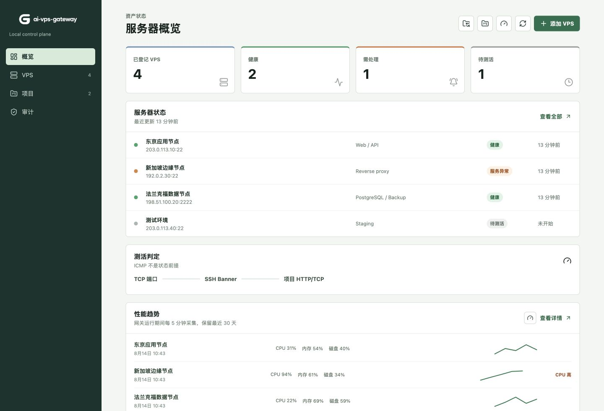
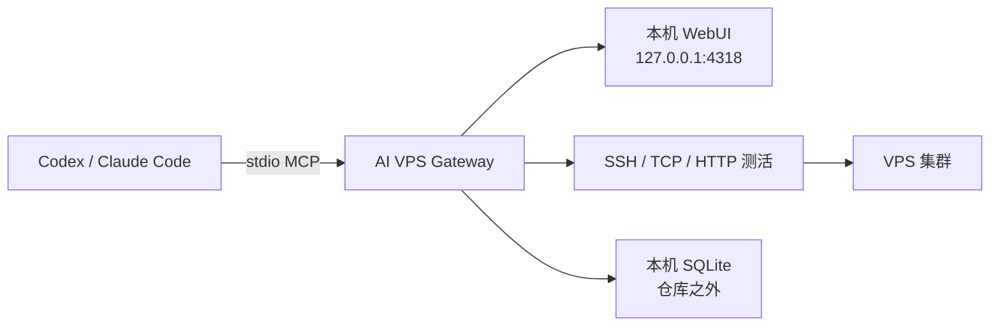

# AI VPS Gateway

<p align="center">
  <picture>
    <source media="(prefers-color-scheme: dark)" srcset="./assets/brand-wordmark.png">
    
  </picture>
</p>

<p align="center">
  <strong>面向 AI 运维的本机优先 VPS 控制平面。</strong><br>
  在一个本地网关中管理服务器、项目、测活、Runbook 和 MCP 访问。
</p>

<p align="center">
  <a href="./README.md">English</a> ·
  <a href="https://kukuaki.github.io/ai-vps-gateway/">项目介绍页</a> ·
  <a href="#快速开始">快速开始</a> ·
  <a href="#mcp">MCP</a> ·
  <a href="https://github.com/kukuaki/ai-vps-gateway/releases/latest">下载 macOS 版本</a>
</p>

<p align="center">
  <a href="https://github.com/kukuaki/ai-vps-gateway/releases"></a>
  <a href="https://github.com/kukuaki/ai-vps-gateway/blob/main/LICENSE"></a>
  
  
</p>

> [!IMPORTANT]
> AI 客户端不会拿到私钥或不受限制的 SSH 路径。它们只能请求本机网关执行操作，由网关持有 SSH 进程、按 VPS 串行化访问、记录高危操作，并把运行数据保存在仓库之外。

> [!NOTE]
> 网关是本机控制边界，不是操作系统级沙箱。同一 macOS 用户运行的其他进程仍可能访问网关数据目录。请使用受保护的本机账户，不要让不可信软件拥有该目录的文件访问权限。

## 能力概览

| 能力 | 提供内容 |
| --- | --- |
| **VPS 管理** | 手动登记、首次 SSH 绑定、TCP/SSH/HTTP(S) 测活、维护和归档状态。 |
| **项目运维** | 服务盘点、技术栈、端口、Web 入口、部署说明和持久化 Runbook。 |
| **AI 接入** | 面向 Codex 与 Claude Code 的本机 stdio MCP；同一 VPS 同时只允许一个活动会话，后续请求排队。 |
| **可观测性** | 当前性能快照、30 天历史、趋势图、阈值告警和审计事件。 |

## 展示图

<p align="center">
  <a href="https://kukuaki.github.io/ai-vps-gateway/">
    
  </a>
</p>

<p align="center"><sub>所有展示图均使用仓库演示数据和文档保留 IP 地址。完整产品导览见 <a href="https://kukuaki.github.io/ai-vps-gateway/">项目介绍页</a>。</sub></p>

## 快速开始

### macOS 桌面版

下载 [最新 Apple Silicon 版本](https://github.com/kukuaki/ai-vps-gateway/releases/latest)，打开 DMG 并启动 **AI VPS Gateway**。应用会一起启动本机 API、WebUI 和 MCP 支持；窗口隐藏后仍可从 macOS 菜单栏调出。

### 从源码运行

```bash
npm install
npm run dev
```

打开 `http://127.0.0.1:5173`。打包或分发前，建议依次运行 `npm run typecheck`、`npm test` 和 `npm run build`。

## 架构



## 核心能力

- 手动新增、编辑、维护和归档 VPS，新增资产带有首次 SSH 绑定向导，数据保存在本机 SQLite。
- 从现有 `all-vps` 文档同步 VPS 清单与已知域名健康检查。
- 不依赖 Ping 的测活：TCP、SSH Banner、HTTP(S) 服务检查。
- 健康历史、当前性能快照、30 天性能历史、SVG 趋势图、阈值告警、审计事件、维护状态和归档状态。
- 项目档案：关联 VPS、Docker/systemd/进程服务和结构化 Runbook。
- 只读盘点远程项目：发现 Docker、systemd、监听端口和常见项目清单，并生成或更新项目 Runbook。
- 默认只绑定 `127.0.0.1` 的 Vue WebUI。
- 供 Codex、Claude Code 使用的本机 stdio MCP 网关：读取可直接执行，远程命令必须先申请独占会话。

网关刻意不读取、上传或暴露私钥内容。新增 VPS 时，网关可在私有凭据目录中生成专属 Ed25519 密钥对；Node 只返回公钥，并由本机 `ssh` 进程使用私钥。已有密钥的显式导入仍只执行本机文件复制，不解析密钥字节。

## 安全边界

- 仓库中不得保存私钥、`.env`、Token 或生产数据库导出。
- WebUI 与 API 默认仅本机可访问。
- MCP 命令执行只允许从本机发起，并且必须经过会话租约：同一 VPS 同时只有一个活动会话，后续请求排队；默认空闲 30 分钟释放，最长 8 小时。
- 高危命令会以 warning/critical 写入审计。少数不可逆命令会直接阻断，包括常见的根目录递归删除、文件系统格式化、块设备写入和 fork bomb 形式；这是一层保底规则，不是完整 Shell 沙箱。
- 已登记凭据和主机指纹的 `root` VPS 可以直接开启普通会话。WebUI 的 8 小时 root 救援提示是可选的，只用于突出高危审计；它不是会话、性能、项目盘点或命令执行的前置条件，开启或关闭都不会中断已有会话。
- 命令和输出在保存前脱敏，默认保存 90 天后清理；资产、项目摘要和审计事件继续保存在本机 SQLite。
- ICMP Ping 失败不会直接判定 VPS 离线；SSH/TCP 和项目健康检查才是主判断依据。
- SSH 执行不会继承 HTTP/SOCKS 代理环境变量，并明确关闭 `ProxyCommand` 与 `ProxyJump`；all-vps 资产默认使用 `networkMode=direct`，让 SSH 绑定物理网卡，避免 macOS TUN 模式把云服务器的登录出口变成代理地址。公开 HTTP(S) 健康检查默认使用系统路由，用来验证域名公开路径，不会被误当成源站 SSH 流量。
- 首次绑定测试只会在本机没有该主机指纹时使用一次 `StrictHostKeyChecking=accept-new` 进行登记；后续所有操作都严格校验指纹，已登记主机的指纹变化绝不会被自动覆盖。
- `all-vps` 同步不会读取私钥，并会保留本机凭据引用、维护状态和可选 root 救援状态。

## 环境要求

- macOS 或 Linux
- Node.js 24+
- npm 11+
- OpenSSH 客户端工具：`ssh` 与 `ssh-keygen`

## 本地开发

```bash
npm install
npm run dev
```

浏览器打开 `http://127.0.0.1:5173`。

```bash
npm run typecheck
npm run test
npm run build
```

运行数据默认放在仓库外：

```text
~/Library/Application Support/AI VPS Gateway/gateway.sqlite
```

开发或测试时可以设置 `ALLVPS_DATA_DIR` 覆盖该目录。

只要网关进程持续运行，性能调度器默认每 5 分钟采集一次符合条件的 VPS（包括手动添加、清单同步和已登记的 root VPS），并保留 30 天。概览和 VPS 详情页会显示历史趋势；CPU 达到 90%、内存达到 90%、磁盘达到 85%，或性能从可用变为不可用时，会写入去重后的 warning 审计告警。“立即采集全部性能”会覆盖所有未归档的已登记 VPS，不只处理从 `all-vps` 导入的资产。

## macOS 桌面客户端

桌面客户端把本机 API、MCP 适配器、WebUI 和 macOS 菜单栏常驻组合在一个应用中。双击应用后，网关自动绑定 `127.0.0.1:4318` 并打开可视化界面；关闭或最小化窗口时只隐藏窗口，本地网关和 MCP 继续运行。点击菜单栏图标会弹出菜单，可打开仪表盘、MCP 设置、数据目录或退出。退出应用时，只关闭由它自己启动的本地网关，不会停止远程 VPS 服务。运行数据和凭据仍保存在用户目录，不会打包进应用。

在 Apple Silicon Mac 上构建 arm64 安装包：

```bash
npm run package:desktop
```

桌面打包命令会先复制到临时隔离 staging 目录，再把产物写入 `release/`；不会让 electron-builder 改写源码的 package manifest。

产物位于 `release/`，包括 `.dmg` 和 `.zip`。开发时可用 `npm run run:desktop` 启动已构建的桌面窗口。应用图标、WebUI 品牌标识和菜单栏模板分别打包，确保三个位置使用正确的图形。应用右上角的 MCP 设置入口可以一键登记 Codex 或 Claude Code；标准 MCP 连接仍由对应 AI 客户端按 stdio 启动，客户端只通过本机网关 API 工作。

SSH 执行默认使用以下本机目录：

```text
~/Library/Application Support/AI VPS Gateway/credentials/
~/.ssh/known_hosts
```

新增 VPS 后，WebUI 会自动生成专属 Ed25519 密钥对，只展示公钥和一条可重复执行的安装命令。用户只需通过云厂商网页终端、已有 SSH 登录或其他已授权入口，以所选 SSH 用户执行一次该命令，再回到 WebUI 点击“测试绑定”。无交互 SSH 测试成功后，网关才会写入逻辑凭据引用并解锁会话、项目盘点和性能采集。私钥始终以 `0600` 保存在网关目录中，不会显示在界面、写入仓库或交给 AI 客户端。

首次成功测试会把新的主机指纹登记到本机 `known_hosts`；后续操作要求精确匹配，服务器重装或主机密钥变更时会拒绝连接并要求人工核对。已有导入密钥仍通过原有的逻辑 `credentialRef` 工作。可以设置 `ALLVPS_CREDENTIAL_DIR` 或 `ALLVPS_KNOWN_HOSTS_FILE` 使用其他位置。

## 同步现有 all-vps 清单

默认同步源是：

```text
~/Desktop/all-vps/VPS_INVENTORY.md
~/Desktop/all-vps/DOMAINS.md
```

可以在 WebUI 顶栏使用同步预览，也可以在终端运行：

```bash
npm run sync:all-vps -- --dry-run
npm run sync:all-vps
```

如需使用其他本机目录，设置 `ALLVPS_SOURCE_DIR`。同步器只会读取上述两份 Markdown 文档；不会扫描目录、读取 `.key`，或导入任何私钥、Token、密码和环境变量。

同步以 SSH 地址和端口建立稳定标识，并会更新名称、SSH 登录信息、用途、标签、网络路径与 HTTP 健康检查。VPS 记录会保持 `accessUrl` 为空：Web 地址属于项目，因为一台 VPS 可能承载多个互不相关的站点。本机的凭据引用、维护状态和可选 root 救援状态会保留。清单中已移除的资产只会在预览中提示，不会被自动归档。WebUI 应用同步时会校验预览摘要，文档发生变化后必须重新预览。

## 同步远程项目

项目盘点通过只读 SSH 执行，只收集有限元数据：主机名、系统、Docker 容器名称/镜像/状态/端口映射/挂载、非基础 systemd 服务、PM2/Node 进程名称、PID、工作目录和监听端口、项目清单路径和依赖名称，以及筛选后的已启用 Nginx 路由指令（`server_name`、`listen`、`proxy_pass`、`root`）。不会读取环境变量、日志、私钥、Token 或完整配置文件。Nginx 路由会依据静态目录、反代上游端口、进程工作目录和服务管理器证据归并到项目；域名只记录为项目 Web 入口，不会单独生成“域名项目”。服务器级健康检查域名只用于 VPS 测活，不会凭空附加到项目；证书续期用的 `acme`、`letsencrypt`、`certbot` 路由也不会被当成站点入口。对于公开映射 `2095/tcp` 的 S-UI Docker 服务，网关会记录默认管理入口 `http://<server>:2095/app/`；订阅端口不会被当作普通 Web 入口。结果保存在本机，并按稳定的 `remote-inventory` 标识创建或更新项目档案，自动填写技术栈、项目级 Web 入口（发现到时）、详细服务清单、项目概览、部署步骤、验证步骤、排错手册和变更边界。消失的自动项目只会归档不会删除；完整盘点成功后，历史自动项目会解除与当前 VPS 的实时关联但保留归档记录；如果盘点有警告，也不会执行缺失项目归档。

```bash
npm run sync:vps-projects
```

WebUI 和 MCP 都支持单台及全部 VPS 的项目盘点。批量项目盘点会覆盖所有未归档的已登记 VPS，包括手动添加的资产；`all-vps` 名称仅为兼容现有命令和 MCP 工具而保留。

## SSH 网络路径

每台 VPS 有 `system` 或 `direct` 两种 SSH 网络模式。all-vps 资产和 WebUI 新增资产默认使用 `direct`，让 SSH/TCP 基线探针绑定检测到的物理网卡（也可以通过 `ALLVPS_SSH_DIRECT_INTERFACE` 指定，例如 `en0`），避免本机 TUN/代理路由；`system` 仍可在单台 VPS 上显式选择。公开 HTTP(S) 健康检查默认使用 `system`，按操作系统路由验证域名公开路径；若需要源站检查，可在单条健康检查中显式选择 `direct`，此时会连接 VPS 登记地址并保留域名 Host 与 TLS SNI。它只影响网关流量，不会修改 Clash/TUN 的全局规则。

## 导入 all-vps 凭据

该命令是显式本机操作，不属于 Markdown 同步。它只在 `all-vps` 顶层查找文件名包含已登记 VPS 地址的 `.key` 或 `.pem`，每台服务器必须唯一匹配；不会读取、打印或上传密钥内容，也不会删除源文件、覆盖已有引用或覆盖网关中的同名文件。

```bash
npm run import:all-vps-credentials -- --dry-run
npm run import:all-vps-credentials
```

导入后的副本存放于 `~/Library/Application Support/AI VPS Gateway/credentials/`，目录权限为 `0700`，文件权限为 `0600`。数据库只记录逻辑文件名。

## MCP

先启动本机 API，再把 stdio 适配器注册到客户端：

```json
{
  "mcpServers": {
    "ai-vps-gateway": {
      "command": "npm",
      "args": ["--prefix", "/absolute/path/to/ai-vps-gateway", "run", "mcp"]
    }
  }
}
```

使用 macOS 桌面客户端时，不需要让 AI 客户端启动 Node/npm。先打开桌面上的 `AI VPS Gateway.app`，然后在右上角 MCP 设置中一键登记；等价的 stdio 配置是：

```json
{
  "mcpServers": {
    "ai-vps-gateway": {
      "command": "/path/to/AI VPS Gateway.app/Contents/MacOS/AI VPS Gateway",
      "args": ["--mcp"]
    }
  }
}
```

桌面窗口隐藏后，本机 API 和 MCP 仍然可用。需要停止服务时，从菜单栏菜单选择“退出”；此时只会停止由该桌面应用启动的本地网关。

当前提供：`list_servers`、`get_server`、`get_dashboard`、`prepare_ssh_binding`、`test_ssh_binding`、`list_projects`、`get_project`、`create_project`、`update_project`、`delete_project`、`delete_server`、`list_sessions`、`open_session`、`get_session`、`run_command`、`close_session`、`collect_metrics`、`collect_all_metrics`、`get_metric_history`、`list_metric_alerts`、`sync_server_projects`、`sync_all_vps_projects`。

对于尚未绑定的新 VPS，Agent 可先调用 `prepare_ssh_binding`，让用户在云厂商控制台或已有登录中执行返回的公钥安装命令，再调用 `test_ssh_binding`。正常执行流程是：先 `open_session`，如果返回排队就等待，再通过 `run_command` 执行，必要时使用 `collect_metrics` 获取当前性能，完成后 `close_session`。root VPS 通过正常凭据和主机指纹检查后即可走同一流程；WebUI 的 root 救援提示只是额外的高危告警和审计信号。API 和 MCP 适配器默认只绑定 `127.0.0.1`，AI 不会拿到私钥或任意本机 SSH 路径。

项目 Runbook 分为项目概览、部署步骤、验证步骤、排错手册和变更边界五部分。当前保存在本机 SQLite，后续 AI 会话可读取，也可通过明确的本机 MCP 项目工具新建或更新；不要在 Runbook 中写入密码、Token、私钥或完整环境变量。WebUI 还可一键复制带项目或 VPS 上下文的运维、新增项目提示词，且不会暴露凭据。

### 删除流程

WebUI 的“复制删除项目提示词”会经过两次确认。提示词要求 Agent 先通过网关盘点、清理并验证远程服务，再调用 `delete_project` 删除本机项目档案；共享 Nginx、`sing-box`、VLESS/Reality、SS 和 Cloudflare 节点必须逐项保护。`delete_project` 本身只删除本机项目记录，不会替代远程清理。

“复制删除 VPS 提示词”同样需要两次确认。`delete_server` 只允许在没有项目关联、没有活动或排队会话时删除本机 VPS 记录；它不会删除远程主机。完整盘点会把过期的自动归档记录解除实时关联但保留历史；仍存在的归档项目或手动项目关联依然会阻止删除。

从源码运行时，先启动本机 API/WebUI，再分别注册 MCP：

```bash
PROJECT_DIR="/path/to/ai-vps-gateway"
npm --prefix "$PROJECT_DIR" run dev

codex mcp add ai-vps-gateway -- npm --prefix "$PROJECT_DIR" run mcp
codex mcp get ai-vps-gateway

claude mcp add --scope user ai-vps-gateway -- npm --prefix "$PROJECT_DIR" run mcp
claude mcp get ai-vps-gateway
```

注册后如果客户端已经打开，重启对应客户端让工具列表刷新。在对话中直接要求 Agent 使用 `ai-vps-gateway`，例如：“先读取项目 Runbook，再盘点目标 VPS；需要改动时申请独占会话，通过网关执行，完成后释放会话。”正常流程是用 `get_project`/`list_servers` 获取上下文，用 `open_session` -> `run_command` 执行运维，最后调用 `close_session`。

## 许可证

[MIT](./LICENSE)

## 项目链接

- [项目介绍页](https://kukuaki.github.io/ai-vps-gateway/)
- [贡献指南](./CONTRIBUTING.md)
- [路线图](./ROADMAP.md)
- [变更记录](./CHANGELOG.md)
- [安全策略](./SECURITY.md)
